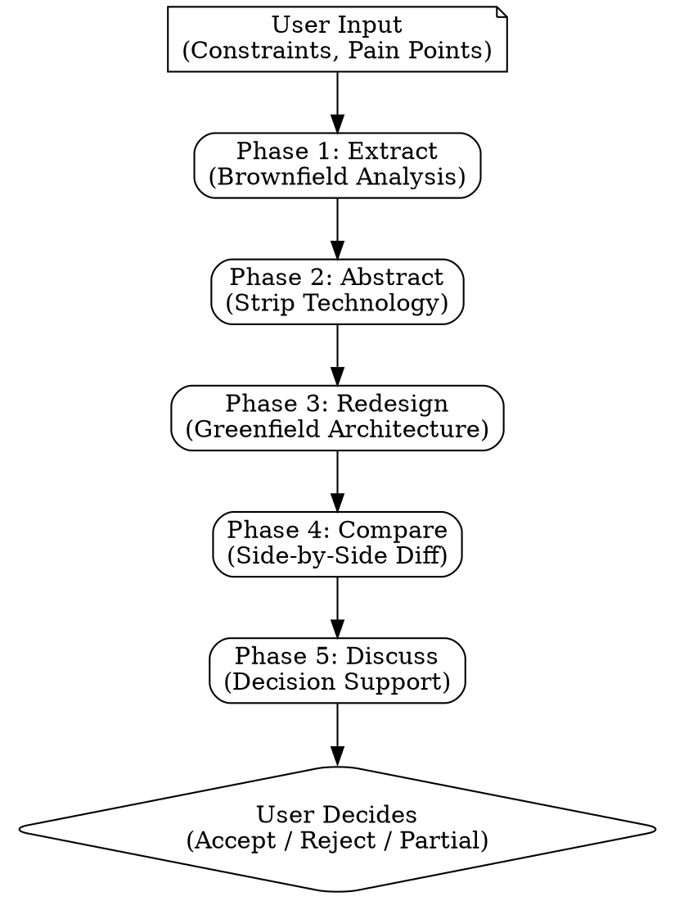

# Brownfield to Greenfield Diff Engine

Structured analysis that answers: "If I were starting from scratch today, knowing what I know now, what would I do differently?" This is NOT a mandate to rewrite. It is a decision-support tool that extracts what the system *does*, separates that from *how* it does it, proposes a modern alternative, and lets the user compare both side-by-side before deciding.

The user always decides. This skill recommends, never mandates.

## When to Use

- Inherited a codebase and need to understand what's intentional vs accidental
- Considering a major migration or modernisation effort and need to scope the work
- Tech debt has accumulated and you need a structured way to prioritise what to address
- Evaluating whether to refactor incrementally or start fresh
- Preparing a business case for architectural investment (need cost/risk data)

## When NOT to Use

- The project is already greenfield (use `brainstorming` or `ddia-design` instead)
- You just need a stack audit without the redesign step (use stack-audit directly)
- The problem is a specific bug or performance issue (use `systematic-debugging`)
- The user has already decided to rewrite and just needs implementation help (use `writing-plans` then `executing-plans`)

## Process

Work through five phases **sequentially**. Each phase feeds the next. Do not skip phases.



---

### Phase 1: Extract (Brownfield Analysis)

Scan the existing project to build the intent graph. This is the foundation — everything downstream depends on getting this right.

**What to extract:**

| Category | Description | How to Find It |
|----------|-------------|----------------|
| Business intents | What problems does this system solve? (user auth, order processing, notifications) | Read route handlers, service classes, domain models, README |
| Data flows | How does data move? (ingestion, processing, storage, presentation) | Trace from entry points (API routes, event handlers) through to persistence |
| Integration boundaries | What external systems does it talk to? (payment providers, email, third-party APIs) | Search for HTTP clients, SDK imports, env vars with URLs/keys |
| Patterns in use | What architectural patterns exist? (MVC, microservices, event-driven, CQRS) | Examine directory structure, class hierarchies, messaging infrastructure |
| Constraints | What hard constraints exist? (regulatory, performance SLAs, data residency, backward compat) | Check compliance docs, SLA definitions, deployment configs, ask the user |
| Pain points | What causes friction? (slow deploys, flaky tests, scaling bottlenecks, tech debt) | Git churn analysis, CI build times, ask the user |
| Team structure | How does the team map to the codebase? (Conway's Law implications) | Ask the user, check CODEOWNERS, examine commit author distribution |

**Extraction techniques:**

1. **Project structure scan** — directory layout, file naming conventions, module boundaries
2. **Dependency analysis** — parse package files (package.json, requirements.txt, Cargo.toml, etc.) for framework choices, utility libraries, and version ages
3. **CI/CD config review** — build steps, test stages, deployment targets, environment count
4. **Git churn analysis** — files that change most frequently indicate where pain lives; run `git log --format=format: --name-only | sort | uniq -c | sort -rn | head -30`
5. **Architecture doc review** — read any existing docs in `docs/`, `architecture/`, ADRs, or READMEs
6. **User interview** — ask targeted questions about constraints and pain points that code alone cannot reveal

**Output:** A structured intent graph document covering all seven categories above.

---

### Phase 2: Abstract (Strip Technology)

Convert the extraction into a technology-agnostic intent graph. The goal is to separate *what the system does* from *how it does it*.

**Abstraction rules:**

- Replace specific technologies with generic capabilities:
  - "PostgreSQL" becomes "relational database with ACID guarantees"
  - "Redis" becomes "in-memory cache / message broker"
  - "Kafka" becomes "distributed event log with ordering guarantees"
  - "React" becomes "component-based UI with client-side rendering"

- Replace specific frameworks with patterns:
  - "Express.js middleware chain" becomes "request pipeline with middleware pattern"
  - "Django ORM" becomes "active-record data access layer"
  - "Spring Boot dependency injection" becomes "IoC container with constructor injection"

- Preserve constraints as-is (regulatory requirements are technology-independent)
- Preserve data flow shapes (event-driven stays event-driven if that's the intent)
- Preserve performance characteristics that are requirements, not implementation details

**Classification — the hard part:**

For every technology choice and pattern, classify it:

| Classification | Criteria | Example |
|---------------|----------|---------|
| **Intentional** | Architecture docs justify it; used consistently; aligns with known constraints; recent commits show deliberate investment | Choosing PostgreSQL for JSONB support to handle semi-structured data |
| **Accidental** | Only used in one area while different patterns used elsewhere; no docs or commit messages explain it; version years out of date; team actively works around friction it causes | jQuery in one page while React is used everywhere else |
| **Unknown** | Could be either; constraint may have expired; choice predates current team | A specific message queue that nobody remembers choosing |

For "Unknown" items, **ask the user**. Do not guess. Present the item with context and let them classify it.

**Output:** A technology-agnostic intent document where every item is classified as intentional, accidental, or resolved-unknown.

---

### Phase 3: Redesign (Greenfield Architecture)

Using the intent graph from Phase 2, design a fresh architecture as if starting today.

**Design principles:**

1. **Start from constraints** — hard constraints are non-negotiable; design around them first
2. **Match the team** — propose technologies the team can actually maintain; do not propose Rust if the team is all Python developers
3. **Apply current best practices** — use what has proven effective, not what is merely trendy
4. **Preserve intentional choices** — if a Phase 2 choice was classified as intentional and still makes sense, keep it; greenfield does not mean different-for-the-sake-of-different
5. **Simplify where possible** — if the brownfield system has accidental complexity, the greenfield design should eliminate it
6. **Design for the current constraints** — requirements change over five years; do not carry forward constraints that no longer apply

**Coverage checklist (15-domain taxonomy):**

Ensure the greenfield design addresses each applicable domain:

1. Language and runtime
2. Package management
3. Framework and architecture pattern
4. Database and data access
5. Authentication and authorisation
6. API layer (REST, GraphQL, gRPC)
7. Frontend / UI
8. State management
9. Testing strategy
10. CI/CD pipeline
11. Infrastructure and deployment
12. Observability (logging, monitoring, tracing)
13. Security posture
14. Documentation approach
15. Developer experience (local dev, onboarding)

For each domain, justify the choice by referencing the intent graph. Every decision should trace back to a business intent or constraint.

**Output:** A complete greenfield architecture proposal with justifications for each domain.

---

### Phase 4: Compare (Side-by-Side Diff)

Produce a structured comparison between the brownfield reality and the greenfield proposal.

For each domain in the taxonomy, document:

| Field | Description |
|-------|-------------|
| **Brownfield (Current)** | What exists today, including version and pattern |
| **Greenfield (Proposed)** | What the fresh design recommends |
| **Change description** | What specifically changes and WHY (not just "it's better") |
| **Migration cost** | One of: trivial / moderate / significant / rewrite |
| **Risk level** | One of: low / medium / high / critical |
| **Intermediate states** | Can this change be deployed incrementally? What do the in-between states look like? |

**Migration cost definitions:**

- **Trivial** — config change, dependency update, or drop-in replacement; less than a day
- **Moderate** — requires code changes across multiple files but the pattern is mechanical; days to a week
- **Significant** — requires rearchitecting a subsystem; weeks of effort with testing
- **Rewrite** — the component must be rebuilt from scratch; months of effort with data migration

**Risk level definitions:**

- **Low** — change is isolated, easily reversible, well-understood
- **Medium** — change touches multiple components, reversible with effort
- **High** — change affects data or external contracts, partially reversible
- **Critical** — change affects core data models or external integrations, difficult to reverse

**Output:** A comparison matrix covering all applicable domains with cost and risk data.

---

### Phase 5: Discuss (Decision Support)

Present the comparison and help the user make decisions. Structure recommendations into four buckets:

**Quick Wins (Do Now)**
Changes where: migration cost is trivial or moderate AND risk is low or medium AND impact is meaningful. These are the "no-brainer" improvements.

**Phased Migration (Plan For)**
Changes where: migration cost is moderate or significant AND a clear incremental path exists AND each intermediate state is deployable and functional. Include a rough sequencing order.

**Accept As-Is (Leave Alone)**
Things where: the brownfield choice is still reasonable OR migration cost outweighs the benefit OR the team has more important things to work on. Explicitly calling out "this is fine" prevents unnecessary churn.

**Rewrite Required (Only If...)**
Changes where: the migration cost is "rewrite" level. State the conditions under which this would be justified (scaling cliff, end-of-life dependency, security vulnerability with no patch). Never recommend a rewrite without a clear triggering condition.

**Cost summary:**
- Estimate total effort for quick wins alone
- Estimate total effort for quick wins + phased migration
- Estimate total effort for a full greenfield rewrite
- Let the user see the spectrum and choose their investment level

**Output:** Categorised recommendations with effort estimates and a clear decision framework.

---

## Deliverable

Save the complete analysis to `docs/plans/YYYY-MM-DD-<project>-brownfield-greenfield.md`:

```markdown
# Brownfield to Greenfield Analysis: [Project Name]
**Date:** YYYY-MM-DD
**Analyst:** [who ran this]
**Codebase:** [repo URL or path]

## Phase 1: Intent Graph

### Business Intents
[What the system does, technology-free]

### Data Flows
[How data moves, technology-free]

### Integration Boundaries
[External systems and contracts]

### Constraints
[Hard constraints that any redesign must respect]

### Pain Points
[What causes friction today]

### Team Structure
[How the team maps to the codebase]

## Phase 2: Abstracted Architecture
[Technology-agnostic description with intentional/accidental classification]

## Phase 3: Greenfield Proposal
[Fresh architecture using current best practices, with justifications]

## Phase 4: Comparison Matrix

| Domain | Brownfield (Current) | Greenfield (Proposed) | Change | Migration Cost | Risk |
|--------|---------------------|----------------------|--------|---------------|------|
| Language & Runtime | [current] | [proposed] | [what/why] | [cost] | [risk] |
| Package Management | ... | ... | ... | ... | ... |
| Framework & Pattern | ... | ... | ... | ... | ... |
| Database & Data | ... | ... | ... | ... | ... |
| Auth | ... | ... | ... | ... | ... |
| API Layer | ... | ... | ... | ... | ... |
| Frontend / UI | ... | ... | ... | ... | ... |
| State Management | ... | ... | ... | ... | ... |
| Testing | ... | ... | ... | ... | ... |
| CI/CD | ... | ... | ... | ... | ... |
| Infrastructure | ... | ... | ... | ... | ... |
| Observability | ... | ... | ... | ... | ... |
| Security | ... | ... | ... | ... | ... |
| Documentation | ... | ... | ... | ... | ... |
| Developer Experience | ... | ... | ... | ... | ... |

## Phase 5: Recommendations

### Quick Wins (Do Now)
[High impact, low cost changes with effort estimates]

### Phased Migration (Plan For)
[Changes that can happen incrementally, with sequencing]

### Accept As-Is (Leave Alone)
[Things that are not worth changing, with justification]

### Rewrite Required (Only If...)
[Changes that need significant effort — triggering conditions stated]

### Cost Summary
- Quick wins only: [effort estimate]
- Quick wins + phased migration: [effort estimate]
- Full greenfield rewrite: [effort estimate]

## Decision Log
- **[Topic]:** Chose [X] over [Y] because [reasoning].
- **Rejected:** [Alternative] — [why it was rejected].
```

## Anti-patterns

| Anti-pattern | Why It Fails | What to Do Instead |
|-------------|-------------|-------------------|
| Treating this as a mandate to rewrite | Rewrites fail more often than they succeed; most value comes from targeted improvements | Present options and let the user choose their investment level |
| Ignoring migration cost | The best architecture is worthless if you cannot get there from here | Every recommendation must include a realistic cost estimate |
| Assuming brownfield choices were wrong | They may have been right for the constraints that existed at the time | Classify as intentional/accidental before judging |
| Proposing tech the team cannot maintain | A Haskell rewrite for a JavaScript team creates a staffing crisis | Match the greenfield design to the team's actual capabilities |
| Stripping constraints that are still active | Regulatory and contractual obligations do not expire because you wish they would | Verify every constraint's current status before removing it |
| Ignoring Conway's Law | Architecture that fights team structure will lose | Factor team boundaries into the greenfield design |
| Skipping intermediate states | Each step of a phased migration must be independently deployable | Map out every intermediate state and verify it works |
| Greenfield-for-the-sake-of-greenfield | Changing things that work just because they are old wastes effort and introduces risk | Only propose changes where the delta justifies the cost |
