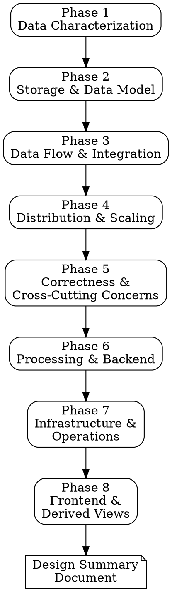

# DDIA System Design Review

## Overview

A structured system design review grounded in principles from *Designing Data-Intensive Applications* by Martin Kleppmann. Walks through 8 sequential phases — from raw data characteristics to frontend presentation — ensuring no critical design decision is skipped.

## When to Use

- Starting a new project and need to make foundational architecture decisions
- Adding a major feature that changes data flow, storage, or consistency requirements
- Reviewing an existing system for design gaps or scaling concerns
- Preparing for a system design discussion or architecture review
- Migrating between architectures (monolith to microservices, SQL to NoSQL, etc.)

## When NOT to Use

- Small UI-only changes with no backend/data implications
- Pure refactoring that doesn't change system behavior
- Bug fixes with clear root causes

## Process

Work through each phase **sequentially**. Do NOT skip ahead. At each phase:

1. **Ask** the user targeted questions about their specific project
2. **Recommend** concrete approaches, citing DDIA trade-offs
3. **Summarize** decisions made before moving to the next phase
4. **Record** decisions in a running design document

If the user's project doesn't need a phase (e.g., no distribution needed), explicitly acknowledge and skip with rationale.

Reference chapter summaries in `software-architecture/ddia/` when explaining trade-offs to ground recommendations in the source material.



---

## Phase 1: Data Characterization

Understand what you're dealing with before choosing any technology.

**Questions to ask:**
- What kind of data does this system handle? Structured, semi-structured, unstructured?
- What is the expected volume? (GB, TB, PB — now and in 2 years)
- What is the velocity? (writes/sec, reads/sec, burst patterns)
- What are the read/write ratios? (read-heavy, write-heavy, balanced)
- What are the access patterns? (key lookup, range scan, full-text search, graph traversal, aggregation)
- What are the durability requirements? (can you afford to lose data? how much?)
- What are the consistency requirements per data type? (strong, causal, eventual)
- Is this OLTP, OLAP, or both?

**DDIA grounding:** Ch. 1 (load parameters, describing performance), Ch. 3 (OLTP vs OLAP distinction)

**Key trade-offs to surface:**
- Throughput vs latency — which matters more?
- Consistency vs availability — where on the spectrum?
- Use percentiles (p50, p95, p99) not averages when discussing latency targets

**Deliverable:** A data profile document listing each data type with its volume, velocity, access pattern, and consistency requirement.

---

## Phase 2: Storage & Data Model

Choose the right storage engine and data model for the access patterns identified in Phase 1.

**Questions to ask:**
- Which data model fits? (relational, document, graph, time-series, key-value)
- What are the key entities and their relationships? (one-to-many, many-to-many)
- Do relationships matter as much as the entities? (→ graph model)
- Is the data naturally document-shaped (tree-like, self-contained)?
- Do you need joins? How complex? How frequent?
- What encoding format for storage and communication? (JSON, Protobuf, Avro)
- What storage engine characteristics matter? (write-optimized LSM-tree vs read-optimized B-tree)
- Do you need full-text search? Fuzzy matching?

**DDIA grounding:** Ch. 2 (relational vs document vs graph), Ch. 3 (LSM-trees vs B-trees, column storage), Ch. 4 (encoding formats, schema evolution)

**Key trade-offs to surface:**
- Document model: schema flexibility, data locality, but weak joins
- Relational model: strong joins, many-to-many, but impedance mismatch
- Graph model: when relationships are first-class citizens
- LSM-trees: better write throughput, higher compression
- B-trees: better read performance, predictable latency
- Schema-on-write (relational) vs schema-on-read (document) — consider evolution needs
- Binary encoding (Protobuf/Avro) vs JSON — compactness vs human readability

**Deliverable:** Entity-relationship diagram, chosen data model(s) with rationale, storage engine selection.

---

## Phase 3: Data Flow & Integration

How does data move between components and systems?

**Questions to ask:**
- How many distinct data systems are involved? (primary DB, cache, search index, analytics warehouse, etc.)
- Which is the system of record (source of truth) for each data type?
- What is derived data vs primary data?
- How should derived data stay in sync? (CDC, event sourcing, dual writes, ETL)
- Is the communication sync (request/response) or async (messaging, events)?
- Do you need exactly-once delivery semantics?
- Are there cross-system transactions?
- What encoding is used between services? (REST/JSON, gRPC/Protobuf, GraphQL)

**DDIA grounding:** Ch. 4 (modes of dataflow — databases, services, messages), Ch. 11 (CDC, event sourcing), Ch. 12 (system of record vs derived data, dual writes problem)

**Key trade-offs to surface:**
- Dual writes are unreliable (race conditions, partial failures) — prefer single log derivation
- CDC provides reliable derivation from existing databases
- Event sourcing gives complete audit trail but requires careful state derivation
- RPC is not a local function call — embrace the differences (timeouts, retries, idempotency)
- Sync communication: simpler, but creates coupling and cascading failures
- Async messaging: decoupled, buffered, but harder to reason about

**Deliverable:** Data flow diagram showing systems of record, derived data, and communication patterns.

---

## Phase 4: Distribution & Scaling

Does this system need to be distributed? If so, how?

**Questions to ask:**
- Does the data fit on one machine? Will it in 2 years?
- Do you need geographic distribution? (latency, compliance, disaster recovery)
- What replication topology? (single-leader, multi-leader, leaderless)
- Do you need partitioning/sharding? By what key?
- What happens during a network partition? (choose consistency or availability per operation)
- What are the consistency requirements per operation? (linearizable, causal, eventual)
- What quorum configuration? (n, w, r values)
- How will you handle rebalancing?

**DDIA grounding:** Ch. 5 (replication topologies, replication lag problems), Ch. 6 (partitioning strategies, rebalancing, request routing)

**Key trade-offs to surface:**
- Single-leader: simple, but bottleneck and failover risk
- Multi-leader: better availability, but write conflict resolution is hard
- Leaderless: highest availability, but weakest consistency
- Key-range partitioning: good for range queries, risk of hot spots
- Hash partitioning: even distribution, but destroys ordering
- Replication lag creates real problems: read-after-write, monotonic reads, consistent prefix reads
- CAP theorem: during partition, choose C or A — per operation, not globally

**Deliverable:** Distribution architecture — replication topology, partitioning strategy, consistency level per operation.

---

## Phase 5: Correctness & Cross-Cutting Concerns

What can go wrong, and how do you prevent it?

**Questions to ask:**
- What invariants must never be violated? (uniqueness, balances, ordering)
- What transaction isolation level is needed? (read committed, snapshot, serializable)
- Where are the concurrency hazards? (lost updates, write skew, phantoms)
- Do you need distributed transactions? Can you avoid them?
- How do you handle partial failures? (retry, compensating transactions, saga pattern)
- Where do you need consensus? (leader election, distributed locks, uniqueness constraints)
- How do you handle clock skew and process pauses?
- What fencing mechanisms prevent split-brain or zombie processes?

**DDIA grounding:** Ch. 7 (isolation levels, lost updates, write skew, serializability), Ch. 8 (unreliable networks, unreliable clocks, process pauses, fencing tokens), Ch. 9 (linearizability, consensus algorithms, 2PC limitations)

**Key trade-offs to surface:**
- Weak isolation levels have real bugs — understand what your DB actually provides
- Serializable isolation: actual serial execution (simple but limited), 2PL (correct but slow), SSI (optimistic, aborts under contention)
- 2PC blocks when coordinator fails — it's not true consensus
- Consensus (Paxos/Raft) requires majority quorums but avoids blocking
- Fencing tokens prevent stale leaders from corrupting data
- End-to-end correctness is the application's responsibility — no middleware handles it fully
- Consider: can the constraint be enforced asynchronously with compensating actions?

**Deliverable:** Correctness requirements matrix — invariants, isolation levels, failure handling strategy per operation.

---

## Phase 6: Processing & Backend

How is data processed and transformed?

**Questions to ask:**
- What processing model? (request/response, batch, stream, hybrid)
- Are there long-running computations? (analytics, ML training, report generation)
- Do you need real-time derived views or is batch sufficient?
- What join strategies for combining data? (hash join, sort-merge, stream-table, stream-stream)
- What are the latency and throughput targets for each processing path?
- Do you need windowing? (tumbling, hopping, sliding, session)
- How do you handle late-arriving events?
- What exactly-once semantics strategy? (idempotency, checkpointing, microbatching)

**DDIA grounding:** Ch. 10 (MapReduce, dataflow engines, join strategies), Ch. 11 (stream processing, windowing, stream joins, fault tolerance)

**Key trade-offs to surface:**
- Batch: complete, correct, but delayed results
- Stream: timely, incremental, but approximate and harder to reason about
- Lambda architecture (batch + stream) vs kappa architecture (stream only with replay)
- Event time vs processing time — always use event time for business logic
- Dataflow engines (Spark, Flink) supersede MapReduce for most use cases
- Idempotent operations are the simplest path to exactly-once semantics

**Deliverable:** Processing architecture — batch/stream split, join strategies, windowing, exactly-once approach.

---

## Phase 7: Infrastructure & Operations

How do you keep it running?

**Questions to ask:**
- What are the reliability targets? (SLA, uptime %, RPO, RTO)
- What is the failover strategy? (automatic, manual, semi-automatic)
- How do you handle rolling deployments with schema evolution?
- What monitoring and alerting is needed? (latency percentiles, error rates, saturation)
- How do you handle schema migrations without downtime?
- What auditing and integrity checks are needed?
- What is the backup and disaster recovery strategy?
- How do you handle configuration management?

**DDIA grounding:** Ch. 1 (operability, maintainability), Ch. 4 (schema evolution, forward/backward compatibility), Ch. 12 (auditing, integrity vs timeliness)

**Key trade-offs to surface:**
- Forward AND backward compatibility required for rolling deployments
- Immutable event logs provide the ultimate audit trail
- Prioritize integrity over timeliness — stale data is recoverable, corrupt data may not be
- Monitor percentiles (p95, p99), not averages
- Automatic failover is convenient but dangerous (cascading failures)
- Schema evolution: Avro/Protobuf handle this well; JSON schema evolution is ad-hoc

**Deliverable:** Operations runbook outline — SLAs, failover procedures, monitoring strategy, deployment process.

---

## Phase 8: Frontend & Derived Views

How does the user observe and interact with the system's state?

**Questions to ask:**
- How does the client receive state updates? (polling, SSE, WebSocket, push notifications)
- What caching strategy? (CDN, application cache, materialized views, client-side cache)
- How do you handle optimistic updates? What happens on conflict?
- What is the staleness tolerance per view? (real-time, seconds, minutes)
- How do you handle offline operation?
- What is the cache invalidation strategy?
- Do you need real-time collaboration? (conflict resolution, CRDTs, operational transformation)

**DDIA grounding:** Ch. 5 (replication lag effects on user experience), Ch. 11 (derived state, materialized views), Ch. 12 (observing derived state, client-side dataflow)

**Key trade-offs to surface:**
- Push (WebSocket/SSE) vs pull (polling) — push for real-time, pull for simplicity
- Optimistic updates improve UX but require conflict resolution
- Cache invalidation is one of the two hard problems — prefer derived views from event streams
- Offline-first requires conflict resolution strategy (LWW, CRDTs, manual merge)
- Read-after-write consistency matters for user trust — users must see their own writes

**Deliverable:** Frontend data strategy — update mechanism, caching layers, staleness tolerances, offline handling.

---

## Final Output: Design Summary Document

After all phases, produce a consolidated design document:

```markdown
# System Design Summary: [Project Name]

## Data Profile
[From Phase 1]

## Data Model & Storage
[From Phase 2]

## Data Flow Architecture
[From Phase 3]

## Distribution Strategy
[From Phase 4]

## Correctness & Invariants
[From Phase 5]

## Processing Architecture
[From Phase 6]

## Operations & Infrastructure
[From Phase 7]

## Frontend Data Strategy
[From Phase 8]

## Key Trade-offs & Decisions Log
| Decision | Options Considered | Chosen | Rationale |
|----------|-------------------|--------|-----------|
| ... | ... | ... | ... |

## Open Questions & Risks
- ...
```

## Common Mistakes

| Mistake | Fix |
|---------|-----|
| Jumping to technology choices before understanding data | Complete Phase 1 before discussing databases |
| Choosing "eventual consistency" without understanding implications | Map consistency requirements per operation, not globally |
| Ignoring schema evolution | Design encoding and APIs for forward/backward compatibility from day 1 |
| Using dual writes for data integration | Use CDC or event log as single source of derived data |
| Treating all data the same | Different data types have different consistency, latency, and durability needs |
| Skipping correctness analysis | Write skew and phantom bugs are real and hard to catch in testing |
| Over-distributing | A single well-chosen machine is simpler and often sufficient |

## Next Steps

The design summary document feeds into `/writing-plans` for implementation planning, or back into `/software-forge` if running the full lifecycle.
