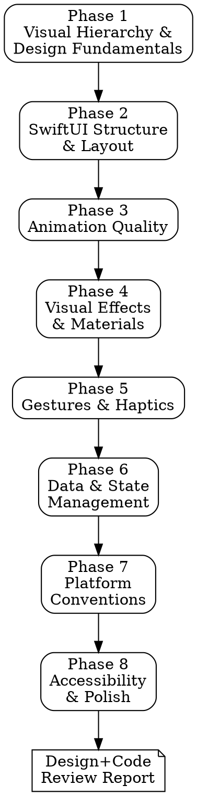

# Design+Code Review

## Overview

A structured design and code review methodology based on *Design+Code* by Meng To. Guides you through 8 sequential phases to systematically evaluate SwiftUI interfaces against the principles that separate amateur from professional Apple platform apps. Covers visual hierarchy, layout structure, animation quality, visual effects, gestures, data management, platform conventions, and accessibility.

## When to Use

- When building a new SwiftUI screen or component and want to validate it against best practices
- During code review of SwiftUI views before merging
- When an interface "feels off" but you cannot pinpoint why
- Before submitting an app to the App Store
- When porting an iOS app to macOS (or vice versa)
- When refactoring a view that has accumulated design debt

## When NOT to Use

- For backend/API code that has no UI component
- For UIKit/AppKit code (this is SwiftUI-focused)
- As a replacement for user testing with real people
- For brand/marketing design decisions (logo, brand colors) -- this is about implementation quality

## Process

Work through each phase **sequentially**. At each phase:

1. **Ask** targeted questions about the specific interface
2. **Read** the relevant chapter summary from `apple-development/design-and-code/` for detailed guidance
3. **Suggest and execute** concrete tests (grep patterns in SwiftUI source, Xcode preview configurations, Accessibility Inspector checks)
4. **Flag findings** with severity: `CRITICAL` / `HIGH` / `MEDIUM` / `LOW` / `INFO`
5. **Summarize** findings before moving to the next phase

If the interface does not have a relevant surface for a phase (e.g., no animations in a static settings screen), acknowledge and skip with rationale.



---

## Phase 1: Visual Hierarchy & Design Fundamentals

**Reference:** `apple-development/design-and-code/s01-design-fundamentals.md`

**Goal:** Verify the interface communicates a clear visual hierarchy and follows foundational design principles.

**Questions to ask:**
- What is the app's personality? (Professional, playful, minimal, expressive?)
- Is there a defined spacing scale, or are padding/spacing values arbitrary?
- Is there a defined type scale, or are font sizes chosen ad hoc?
- Does the interface pass the squint test? (Blur your eyes -- can you identify primary, secondary, and tertiary content?)

**Tests to run:**

**Color usage (60-30-10 rule):**
```
# Check for hardcoded color values instead of semantic/system colors
grep -rn "Color(red:\|Color(#\|UIColor(red:\|NSColor(red:\|\.color(red:" --include="*.swift"

# Check for system/semantic color usage (good practice)
grep -rn "Color\.primary\|Color\.secondary\|Color\.accentColor\|Color(.system" --include="*.swift"

# Check for dark mode support via asset catalogs
find . -name "*.colorset" -type d
```

**Typography hierarchy:**
```
# Check for hardcoded font sizes (prefer system text styles)
grep -rn "\.font(.system(size:" --include="*.swift"

# Check for system text style usage (good practice)
grep -rn "\.font(\.largeTitle\|\.font(\.title\|\.font(\.headline\|\.font(\.body\|\.font(\.caption\|\.font(\.subheadline\|\.font(\.callout\|\.font(\.footnote" --include="*.swift"

# Check for font weight hierarchy
grep -rn "\.fontWeight(\|\.bold(\|\.semibold\|\.light\|\.thin\|\.heavy" --include="*.swift"
```

**Spacing consistency:**
```
# Find arbitrary padding/spacing values (magic numbers)
grep -rn "\.padding(\.[0-9]\|\.padding(EdgeInsets\|spacing: [0-9]" --include="*.swift"

# Check for a defined spacing system (good practice)
grep -rn "enum Spacing\|struct Spacing\|extension CGFloat" --include="*.swift"
```

**Dark mode support:**
```
# Check for hardcoded colors that will not adapt to dark mode
grep -rn "Color\.white\|Color\.black\|Color(\.white)\|Color(\.black)" --include="*.swift"

# Check for colorScheme environment usage
grep -rn "colorScheme\|\.preferredColorScheme\|@Environment.*colorScheme" --include="*.swift"
```

**Flag:**
- `HIGH` -- No dark mode support (hardcoded light-only colors throughout)
- `MEDIUM` -- Hardcoded font sizes instead of system text styles
- `MEDIUM` -- No spacing system (arbitrary padding values everywhere)
- `LOW` -- Minor inconsistencies in spacing or type scale
- `INFO` -- Opportunity to strengthen visual hierarchy with the 60-30-10 rule

**Deliverable:** Assessment of visual hierarchy quality, color system, type scale, and spacing consistency.

---

## Phase 2: SwiftUI Structure & Layout

**Reference:** `apple-development/design-and-code/s02-swiftui-fundamentals.md`, `apple-development/design-and-code/s05-layout-and-composition.md`

**Goal:** Verify SwiftUI code follows structural best practices -- correct property wrappers, clean layout, appropriate navigation, and responsive design.

**Questions to ask:**
- What is the target platform? (iOS, macOS, both?)
- Does the interface need to adapt to different screen sizes?
- How complex is the view hierarchy? Can it be simplified?

**Tests to run:**

**State management correctness:**
```
# Check for @StateObject vs @ObservedObject misuse
grep -rn "@ObservedObject.*=.*\(\)" --include="*.swift"
# ^ CRITICAL: creating objects inline with @ObservedObject causes re-creation on every render

# Check for @State not marked private
grep -rn "@State [^p]\|@State$" --include="*.swift"
# @State should always be private

# Check for single source of truth violations (duplicate state)
grep -rn "@State.*var.*=.*@State\|@Published.*var.*=.*@Published" --include="*.swift"
```

**GeometryReader overuse:**
```
# Count GeometryReader usage (should be rare)
grep -rn "GeometryReader" --include="*.swift"
# If used frequently, suggest alternatives: .onGeometryChange(), Layout protocol, frame modifiers
```

**Hardcoded frame sizes:**
```
# Find hardcoded frame dimensions (may indicate non-responsive design)
grep -rn "\.frame(width: [0-9]\|\.frame(height: [0-9]" --include="*.swift"

# Check for responsive alternatives
grep -rn "\.frame(maxWidth: \.infinity\|ViewThatFits\|horizontalSizeClass\|AnyLayout" --include="*.swift"
```

**Navigation pattern:**
```
# Check navigation container usage
grep -rn "NavigationStack\|NavigationSplitView\|NavigationView" --include="*.swift"
# NavigationView is deprecated -- should use NavigationStack or NavigationSplitView

# Check for programmatic navigation support
grep -rn "NavigationPath\|navigationDestination" --include="*.swift"
```

**Magic numbers in padding/spacing:**
```
# Find raw numeric values in padding and spacing
grep -rn "\.padding([0-9]\|\.padding(\.[a-z]*, [0-9]\|spacing: [0-9]" --include="*.swift"
```

**Modifier order issues:**
```
# Check for common modifier order mistakes
# .background before .padding means background is tight to content
# .clipShape should come after .background
grep -rn -A2 "\.background\|\.clipShape\|\.shadow" --include="*.swift"
```

**Lazy stack usage for lists:**
```
# Check for non-lazy stacks with ForEach (performance issue for large lists)
grep -rn "VStack.*{" --include="*.swift" -A5 | grep "ForEach"
# Should use LazyVStack inside ScrollView for long lists
```

**Flag:**
- `CRITICAL` -- `@ObservedObject` with inline initialization (state loss on re-render)
- `HIGH` -- Deprecated `NavigationView` usage
- `HIGH` -- Non-lazy VStack/HStack with ForEach over large collections
- `MEDIUM` -- Excessive GeometryReader usage where simpler alternatives exist
- `MEDIUM` -- Hardcoded frame sizes preventing responsive layout
- `LOW` -- Magic numbers in padding/spacing values
- `INFO` -- Opportunity to use ViewThatFits or AnyLayout for adaptive layouts

**Deliverable:** Assessment of SwiftUI code structure, state management correctness, and layout quality.

---

## Phase 3: Animation Quality

**Reference:** `apple-development/design-and-code/s03-animations-and-transitions.md`

**Goal:** Verify animations are purposeful, well-tuned, and performant -- every animation should communicate something.

**Questions to ask:**
- What state changes occur in this interface? Are they all animated?
- Are interactive elements providing feedback on press/tap?
- Are view transitions smooth, or do views appear/disappear abruptly?

**Tests to run:**

**Animation curve quality:**
```
# Find linear animations on interactive elements (almost never appropriate for UI)
grep -rn "\.linear\b\|animation(.linear" --include="*.swift"
# Linear is only appropriate for progress bars and loading spinners

# Check for spring animation usage (preferred for UI)
grep -rn "\.spring(\|\.interactiveSpring\|\.bouncy\|\.snappy\|\.smooth" --include="*.swift"

# Check for well-tuned spring parameters
grep -rn "spring(response:\|dampingFraction:" --include="*.swift"
```

**Transition quality:**
```
# Check for transitions on conditional views
grep -rn "\.transition(" --include="*.swift"

# Find if/else view swaps that may lack transitions
grep -rn "if.*{" --include="*.swift" -A3 | grep -B1 "} else {"
```

**matchedGeometryEffect for hero animations:**
```
# Check for matchedGeometryEffect usage (hero transitions)
grep -rn "matchedGeometryEffect\|@Namespace" --include="*.swift"
```

**Animation duration check:**
```
# Find animations longer than 0.5 seconds (likely too slow for UI)
grep -rn "duration: [0-9]*\.\?[5-9]\|duration: [1-9]" --include="*.swift"
```

**Micro-interactions:**
```
# Check for button press effects (custom ButtonStyle)
grep -rn "ButtonStyle\|configuration\.isPressed\|PressableButton\|scaleEffect.*isPressed" --include="*.swift"

# Check for loading state indicators
grep -rn "ProgressView\|isLoading\|shimmer\|skeleton" --include="*.swift"
```

**Animation performance:**
```
# Check for drawingGroup usage on complex graphics
grep -rn "\.drawingGroup()" --include="*.swift"

# Check for layout property animation (less performant than transform animation)
# Animating frame/padding triggers layout recalculation; offset/scale/rotation are GPU-accelerated
grep -rn "withAnimation.*{" --include="*.swift" -A5 | grep "frame\|padding"
```

**Flag:**
- `HIGH` -- Linear animations on interactive elements (feels robotic)
- `HIGH` -- Missing transitions on conditional view changes (abrupt appear/disappear)
- `MEDIUM` -- Animations longer than 0.5 seconds (feels sluggish)
- `MEDIUM` -- No button press feedback (buttons feel unresponsive)
- `MEDIUM` -- No loading states (users stare at blank screens)
- `LOW` -- Spring parameters could be better tuned
- `LOW` -- Missing success/error animation feedback
- `INFO` -- Opportunity for matchedGeometryEffect hero transitions
- `INFO` -- Opportunity for micro-interactions that add delight

**Deliverable:** Assessment of animation purpose, curve quality, transitions, and performance.

---

## Phase 4: Visual Effects & Materials

**Reference:** `apple-development/design-and-code/s04-visual-effects-and-materials.md`

**Goal:** Verify visual effects create appropriate depth and hierarchy -- materials, gradients, shadows, and layering follow Apple's design language.

**Questions to ask:**
- Does the interface communicate elevation/depth, or is everything flat?
- Are shadows consistent across similar elements?
- Are materials used where the background context adds value?

**Tests to run:**

**Material usage:**
```
# Check for system material usage (glass effects)
grep -rn "\.ultraThinMaterial\|\.thinMaterial\|\.regularMaterial\|\.thickMaterial\|\.ultraThickMaterial" --include="*.swift"

# Check for custom blur hacks instead of system materials
grep -rn "\.blur(radius:\|UIVisualEffectView\|UIBlurEffect" --include="*.swift"
# System materials are preferred over custom blur implementations
```

**Shadow system:**
```
# Find shadow usage
grep -rn "\.shadow(" --include="*.swift"

# Check for layered shadows (two-shadow technique for realism)
# Good: two .shadow() modifiers with different radii
# Bad: single heavy shadow

# Check for hardcoded shadow values without a system
grep -rn "\.shadow(color: .black.opacity\|\.shadow(radius:" --include="*.swift"

# Check for a defined elevation/shadow system
grep -rn "enum Shadow\|struct Shadow\|enum Elevation\|struct Elevation" --include="*.swift"
```

**Gradient quality:**
```
# Check for gradient usage
grep -rn "LinearGradient\|RadialGradient\|AngularGradient\|MeshGradient\|\.gradient" --include="*.swift"
```

**Depth and layering:**
```
# Check for ZStack layering (depth through overlap)
grep -rn "ZStack" --include="*.swift"

# Check for continuous corner curves (Apple standard)
grep -rn "style: .continuous\|RoundedRectangle(cornerRadius:" --include="*.swift"
# RoundedRectangle should use style: .continuous for Apple-standard corners
```

**Glassmorphism recipe:**
```
# Check for glass card pattern (material + border + shadow)
grep -rn "\.strokeBorder\|\.stroke(\.white\.opacity\|\.overlay.*stroke" --include="*.swift"
```

**Border overuse:**
```
# Check for borders used where shadows or spacing would be better
grep -rn "\.border(\|\.overlay.*Rectangle.*stroke\|Divider()" --include="*.swift"
```

**Flag:**
- `HIGH` -- Custom blur hacks instead of system materials
- `MEDIUM` -- Single flat shadows without a shadow system (lacks depth hierarchy)
- `MEDIUM` -- Hardcoded shadow values without a defined elevation system
- `MEDIUM` -- Borders used everywhere instead of shadows/spacing for separation
- `LOW` -- Missing continuous corner curve style on RoundedRectangle
- `LOW` -- Flat solid color backgrounds on hero sections where gradients would add depth
- `INFO` -- Opportunity for mesh gradients (iOS 18+) on hero backgrounds
- `INFO` -- Opportunity for the two-shadow technique (tight + ambient) for realistic depth

**Deliverable:** Assessment of depth hierarchy, material usage, shadow system, and visual richness.

---

## Phase 5: Gestures & Haptics

**Reference:** `apple-development/design-and-code/s08-gestures-and-haptics.md`

**Goal:** Verify gesture interactions feel physically real, include haptic feedback, and have accessible alternatives.

**Questions to ask:**
- What gesture-driven interactions exist in this interface?
- Do gestures enhance or replace button-based interactions?
- Can users accomplish every action without gestures?

**Tests to run:**

**Gesture implementation:**
```
# Find gesture usage
grep -rn "DragGesture\|MagnificationGesture\|RotationGesture\|LongPressGesture\|TapGesture\|\.gesture(" --include="*.swift"

# Check for @GestureState usage (proper transient state during gestures)
grep -rn "@GestureState" --include="*.swift"

# Check for velocity-based animation decisions on gesture end
grep -rn "predictedEndTranslation\|predictedEndLocation\|\.velocity" --include="*.swift"

# Check for spring animations on gesture release
grep -rn "\.onEnded.*spring\|\.onEnded.*withAnimation" --include="*.swift"
```

**Haptic feedback:**
```
# Check for haptic feedback integration
grep -rn "UIImpactFeedbackGenerator\|UISelectionFeedbackGenerator\|UINotificationFeedbackGenerator\|\.sensoryFeedback\|impactOccurred\|selectionChanged\|notificationOccurred" --include="*.swift"

# Check for haptic generator preparation (performance)
grep -rn "\.prepare()" --include="*.swift"
```

**Gesture accessibility:**
```
# Check for accessibility alternatives to gestures
grep -rn "\.accessibilityAction\|\.accessibilityAdjustableAction" --include="*.swift"

# Check for swipe action accessibility
grep -rn "\.swipeActions\|\.contextMenu" --include="*.swift"
```

**System gesture conflicts:**
```
# Check for edge gestures that may conflict with system gestures
grep -rn "DragGesture(minimumDistance: 0\|\.highPriorityGesture\|\.simultaneousGesture" --include="*.swift"
```

**Flag:**
- `CRITICAL` -- Gestures without any accessible alternative (excludes VoiceOver users)
- `HIGH` -- Gesture-only interactions with no button fallback (discoverability problem)
- `MEDIUM` -- Gestures without haptic feedback (missing tactile dimension)
- `MEDIUM` -- Missing spring animations on gesture release (snaps instead of settles)
- `LOW` -- Haptic generators not prepared ahead of time (slight delay)
- `LOW` -- Gestures that may conflict with system edge gestures
- `INFO` -- Opportunity for velocity-based animation decisions
- `INFO` -- Opportunity for multi-sensory feedback (animation + haptic + sound)

**Deliverable:** Assessment of gesture implementation quality, haptic integration, and accessibility of gesture-driven interactions.

---

## Phase 6: Data & State Management

**Reference:** `apple-development/design-and-code/s06-data-and-state-management.md`

**Goal:** Verify property wrapper correctness, explicit state handling for loading/error/success, and clean MVVM separation.

**Questions to ask:**
- Where does state live? Is there a single source of truth for each piece of data?
- What happens when data is loading? When it fails? When it succeeds?
- Is business logic in views or in separate view models?

**Tests to run:**

**Property wrapper correctness:**
```
# CRITICAL: @ObservedObject with inline initialization (should be @StateObject)
grep -rn "@ObservedObject.*var.*=.*\(\)" --include="*.swift"

# Check for proper @StateObject usage (owned reference-type state)
grep -rn "@StateObject" --include="*.swift"

# Check for @Observable macro usage (iOS 17+ modern approach)
grep -rn "@Observable\|@Bindable" --include="*.swift"

# Check for @State on reference types (should use @StateObject or @State with @Observable)
grep -rn "@State.*var.*:.*ViewModel\|@State.*var.*:.*Manager\|@State.*var.*:.*Controller" --include="*.swift"
```

**Loading/error/success state handling:**
```
# Check for explicit loading state modeling
grep -rn "enum.*LoadingState\|case loading\|case idle\|isLoading\|enum.*ViewState" --include="*.swift"

# Check for error state handling
grep -rn "case failure\|case error\|errorMessage\|\.alert.*error\|ContentUnavailableView" --include="*.swift"

# Check for empty state handling
grep -rn "ContentUnavailableView\|emptyState\|EmptyState\|noData\|isEmpty" --include="*.swift"
```

**MVVM separation:**
```
# Check for networking in views (should be in ViewModel or Service)
grep -rn "URLSession\|\.data(from:\|fetch.*async\|Task {.*await" --include="*View.swift"

# Check for ViewModel pattern
grep -rn "ViewModel\|@Observable.*class\|ObservableObject" --include="*.swift"

# Check for business logic in views (complex calculations, data transformation)
grep -rn "func.*->.*[^View]\|private func" --include="*View.swift"
```

**Task modifier for async work:**
```
# Check for .task modifier usage (proper lifecycle-aware async)
grep -rn "\.task {" --include="*.swift"

# Check for onAppear with Task (less ideal than .task)
grep -rn "\.onAppear.*Task\|\.onAppear.*{.*await" --include="*.swift"
```

**Flag:**
- `CRITICAL` -- `@ObservedObject` with inline initialization (state loss on re-render)
- `HIGH` -- Missing error state handling (unhandled network/data failures)
- `HIGH` -- Networking or business logic directly in view body
- `MEDIUM` -- No explicit loading state (users see blank screens during data fetch)
- `MEDIUM` -- Missing empty state design (blank screen when no data)
- `LOW` -- Using .onAppear with Task instead of .task modifier
- `LOW` -- Not using @Observable for iOS 17+ targets (increased boilerplate)
- `INFO` -- Opportunity for LoadingState enum pattern
- `INFO` -- Opportunity for offline-first data loading

**Deliverable:** Assessment of state management correctness, error handling coverage, and architectural separation.

---

## Phase 7: Platform Conventions

**Reference:** `apple-development/design-and-code/s09-macos-specific-design.md`, `apple-development/design-and-code/s02-swiftui-fundamentals.md`

**Goal:** Verify the interface follows platform-specific conventions -- iOS apps should feel like iOS; macOS apps should feel like macOS.

**Questions to ask:**
- What platform(s) does this target?
- Does the navigation pattern match the platform expectation?
- Are system-provided components used where they exist, rather than custom reimplementations?

**Tests to run:**

**iOS conventions:**
```
# Check for tab bar navigation (standard iOS top-level navigation)
grep -rn "TabView\|\.tabItem" --include="*.swift"

# Check for safe area handling
grep -rn "\.ignoresSafeArea\|\.safeAreaInset\|\.safeAreaPadding" --include="*.swift"

# Check for system materials on navigation surfaces
grep -rn "\.regularMaterial\|\.toolbarBackground" --include="*.swift"

# Check for presentationDetents (half-sheet support)
grep -rn "\.presentationDetents\|\.presentationDragIndicator" --include="*.swift"
```

**macOS conventions:**
```
# Check for sidebar navigation (standard macOS pattern)
grep -rn "NavigationSplitView\|\.listStyle(.sidebar)" --include="*.swift"

# Check for toolbar and menu bar
grep -rn "\.toolbar\|\.commands\|CommandGroup\|CommandMenu\|MenuBarExtra" --include="*.swift"

# Check for keyboard shortcuts
grep -rn "\.keyboardShortcut" --include="*.swift"

# Check for Table view usage (macOS-specific tabular data)
grep -rn "Table(\|TableColumn" --include="*.swift"

# Check for window management
grep -rn "WindowGroup\|Window(\|\.defaultSize\|\.defaultPosition\|Settings {" --include="*.swift"
```

**Universal patterns:**
```
# Check for SF Symbols usage (platform-native icons)
grep -rn "systemName:\|Image(systemName:" --include="*.swift"

# Check for Dynamic Type support (system font styles)
grep -rn "\.font(\.body\|\.font(\.headline\|\.font(\.title\|\.font(\.caption" --include="*.swift"

# Check for system colors
grep -rn "Color\.primary\|Color\.secondary\|Color\.accentColor\|Color(.system" --include="*.swift"

# Check for deprecated NavigationView
grep -rn "NavigationView" --include="*.swift"
```

**Anti-patterns:**
```
# iOS patterns misused on macOS
grep -rn "TabView.*tabItem\|\.tabViewStyle(.page" --include="*.swift"
# Bottom tab bar is an iOS pattern -- macOS should use sidebar navigation

# Custom reimplementation of system components
grep -rn "struct.*Alert\|struct.*ActionSheet\|struct.*Picker" --include="*.swift"
# Check if these are reimplementing what the system provides
```

**Flag:**
- `HIGH` -- iOS-style bottom tab bar used on macOS (platform mismatch)
- `HIGH` -- Deprecated NavigationView instead of NavigationStack/NavigationSplitView
- `HIGH` -- No keyboard shortcuts in a macOS app (platform expectation)
- `MEDIUM` -- Custom reimplementation of system-provided components
- `MEDIUM` -- No menu bar commands in a macOS app
- `MEDIUM` -- Missing safe area handling on iOS
- `LOW` -- Could benefit from presentationDetents for sheet presentation
- `LOW` -- SF Symbols not used where appropriate
- `INFO` -- Opportunity for NavigationSplitView on iPad/Mac targets
- `INFO` -- Opportunity for Table view on macOS for tabular data

**Deliverable:** Assessment of platform convention adherence and system component usage.

---

## Phase 8: Accessibility & Polish

**Reference:** `apple-development/design-and-code/s10-advanced-techniques.md`

**Goal:** Verify the interface is accessible to all users and polished to production quality -- VoiceOver, Dynamic Type, reduce motion, and designed states for every scenario.

**Questions to ask:**
- Can a VoiceOver user navigate and use every feature?
- Does the interface work at the largest Dynamic Type sizes?
- What happens when there is no data? When the network fails? When a loading operation is in progress?

**Tests to run:**

**VoiceOver labels and hints:**
```
# Check for accessibility labels on interactive elements
grep -rn "\.accessibilityLabel\|\.accessibilityHint\|\.accessibilityValue" --include="*.swift"

# Check for accessibility hidden on decorative elements
grep -rn "\.accessibilityHidden" --include="*.swift"

# Check for accessibility element grouping
grep -rn "\.accessibilityElement(children:" --include="*.swift"

# Check for accessibility traits
grep -rn "\.accessibilityAddTraits\|\.accessibilityRemoveTraits" --include="*.swift"

# Find images without accessibility labels (potential gaps)
grep -rn "Image(\|Image(systemName:" --include="*.swift" | grep -v "accessibilityLabel\|accessibilityHidden\|\.decorative"
```

**Dynamic Type support:**
```
# Check for fixed font sizes (will not scale with system settings)
grep -rn "\.font(.system(size:\|Font.custom.*size:" --include="*.swift"
# Should use system text styles or @ScaledMetric

# Check for @ScaledMetric usage (custom values that scale)
grep -rn "@ScaledMetric" --include="*.swift"

# Check for dynamicTypeSize environment reading
grep -rn "dynamicTypeSize\|DynamicTypeSize" --include="*.swift"
```

**Reduce motion support:**
```
# Check for reduce motion environment reading
grep -rn "accessibilityReduceMotion\|reduceMotion" --include="*.swift"

# Find animations that do not check reduce motion
grep -rn "withAnimation\|\.animation(" --include="*.swift"
# Compare count against reduceMotion checks -- significant gap indicates issue
```

**Empty states:**
```
# Check for designed empty states
grep -rn "ContentUnavailableView\|emptyState\|EmptyState\|empty.*view\|noResults\|noData" --include="*.swift"
```

**Loading states:**
```
# Check for loading indicators
grep -rn "ProgressView\|isLoading\|\.shimmer\|skeleton\|LoadingView\|\.redacted(reason: .placeholder)" --include="*.swift"
```

**Error states:**
```
# Check for error handling UI
grep -rn "\.alert.*error\|errorMessage\|ContentUnavailableView.*error\|retry\|failedToLoad" --include="*.swift"
```

**Color contrast:**
```
# Check for potentially low-contrast text
grep -rn "\.opacity(0\.[0-3]\|\.foregroundStyle(.secondary)\|\.foregroundStyle(.tertiary)" --include="*.swift"
# Very low opacity text may fail WCAG contrast requirements

# Check for color-only meaning (should always pair with text/icons)
grep -rn "\.foregroundStyle(.red)\|\.foregroundStyle(.green)\|Color.red\|Color.green" --include="*.swift"
# Verify color is not the sole indicator of meaning
```

**Flag:**
- `CRITICAL` -- Interactive elements without accessibility labels (VoiceOver users cannot use the app)
- `CRITICAL` -- Fixed font sizes throughout (Dynamic Type users get a broken experience)
- `HIGH` -- No reduce motion support (animations can cause vestibular discomfort)
- `HIGH` -- Missing empty states (users see blank screens with no guidance)
- `HIGH` -- Missing error states (failures are silent or crash)
- `MEDIUM` -- Missing accessibility hints on complex interactions
- `MEDIUM` -- No @ScaledMetric for custom sizes that should scale
- `MEDIUM` -- Color used as sole indicator of meaning (colorblind users excluded)
- `LOW` -- Decorative images not marked as accessibility hidden
- `LOW` -- Missing accessibility element grouping (VoiceOver navigation is verbose)
- `INFO` -- Opportunity for accessibility actions on gesture-driven elements
- `INFO` -- Opportunity for .redacted(reason: .placeholder) skeleton loading

**Deliverable:** Assessment of accessibility completeness, Dynamic Type support, and state design coverage.

---

## Severity Rating Guide

| Severity | Criteria | Examples |
|----------|----------|---------|
| **CRITICAL** | Broken functionality, inaccessible to entire user groups, would cause App Store rejection | Interactive elements without accessibility labels, fixed fonts that break at large Dynamic Type, @ObservedObject inline init causing data loss, gesture-only UI with no accessible alternative |
| **HIGH** | Poor user experience, missing platform conventions, no error handling, accessibility gaps | Missing error/empty states, no keyboard shortcuts on macOS, iOS tab bar on macOS, no reduce motion support, linear animations on all interactions, business logic in views |
| **MEDIUM** | Suboptimal but functional -- inconsistent spacing, missing haptics, minor polish gaps | Arbitrary spacing values, single flat shadows, missing button press feedback, animations > 0.5s, custom blur instead of system material, no loading indicators |
| **LOW** | Could be better -- alternative approach would improve the experience | Spring parameters not tuned, missing continuous corner curves, decorative images not hidden from VoiceOver, minor modifier order issues |
| **INFO** | Suggestion for delight -- would elevate from good to great | Opportunity for matchedGeometryEffect hero transitions, mesh gradient backgrounds, two-shadow technique, multi-sensory feedback, skeleton loading placeholders |

---

## Final Report Template

```markdown
# Design+Code Review Report: [App/Screen Name]
**Date:** [date]
**Reviewer:** [name]
**Platform:** [iOS / macOS / Universal]
**Scope:** [what was reviewed -- specific screens, components, or full app]

## Executive Summary
[1-2 paragraph summary of overall design and code quality, key strengths, and critical gaps]

## Findings Summary
| # | Severity | Finding | Phase |
|---|----------|---------|-------|
| 1 | CRITICAL | [title] | [phase] |
| 2 | HIGH     | [title] | [phase] |
| ... | ... | ... | ... |

## Phase Summaries

### Phase 1: Visual Hierarchy & Design Fundamentals
[Summary of color, typography, spacing, and dark mode findings]

### Phase 2: SwiftUI Structure & Layout
[Summary of state management, layout, navigation, and responsiveness findings]

### Phase 3: Animation Quality
[Summary of animation curves, transitions, micro-interactions, and performance findings]

### Phase 4: Visual Effects & Materials
[Summary of materials, gradients, shadows, and depth findings]

### Phase 5: Gestures & Haptics
[Summary of gesture implementation, haptic feedback, and accessibility findings]

### Phase 6: Data & State Management
[Summary of property wrappers, state handling, and architecture findings]

### Phase 7: Platform Conventions
[Summary of platform-specific adherence findings]

### Phase 8: Accessibility & Polish
[Summary of VoiceOver, Dynamic Type, reduce motion, and state design findings]

## Detailed Findings

### Finding 1: [Title]
**Severity:** CRITICAL / HIGH / MEDIUM / LOW / INFO
**Phase:** [which phase found it]
**Affected Component:** [file, view, or component name]

**Description:**
[What the issue is and why it matters]

**Current Code:**
```swift
// The problematic code
```

**Recommended Fix:**
```swift
// The improved code
```

**Design+Code Reference:**
[Which principle from the book this relates to]

---
[Repeat for each finding]

## Recommendations Priority
1. [Fix CRITICAL findings immediately -- these block accessibility or cause data loss]
2. [Fix HIGH findings before release -- these significantly degrade UX or violate platform conventions]
3. [Fix MEDIUM findings in the next sprint -- these affect polish and perceived quality]
4. [Address LOW/INFO findings during regular maintenance -- these elevate from good to great]

## Strengths
[What the code does well -- acknowledge good patterns to reinforce them]

## Out of Scope / Not Reviewed
[What was explicitly excluded and why]
```

---

## Common Mistakes

| Mistake | Fix |
|---------|-----|
| Reviewing only the visual appearance | Check the code structure, state management, and accessibility -- the best-looking app is broken if VoiceOver cannot navigate it |
| Applying all 8 phases to a simple component | Skip phases that are not relevant. A static label does not need a gesture review. Acknowledge and move on. |
| Flagging every hardcoded value as an issue | Some hardcoded values are intentional (a specific icon size, a one-off padding). Flag patterns of inconsistency, not individual cases. |
| Ignoring platform differences | iOS and macOS have different conventions. A tab bar is correct on iOS but wrong on macOS. Always consider the target platform. |
| Treating INFO findings as problems | INFO-severity items are opportunities for delight, not issues. Frame them as "could be even better" not "this is wrong." |
| Skipping the squint test | The fastest way to evaluate visual hierarchy is to blur your eyes and see if the primary content stands out. Do this before diving into code. |
| Not testing at extreme Dynamic Type sizes | The interface may look perfect at the default size and completely break at the largest accessibility size. Always test both extremes. |
| Recommending animations everywhere | Not every view needs animation. Static content, settings screens, and data-dense tables may be better without animation. Animation should communicate, not decorate. |
